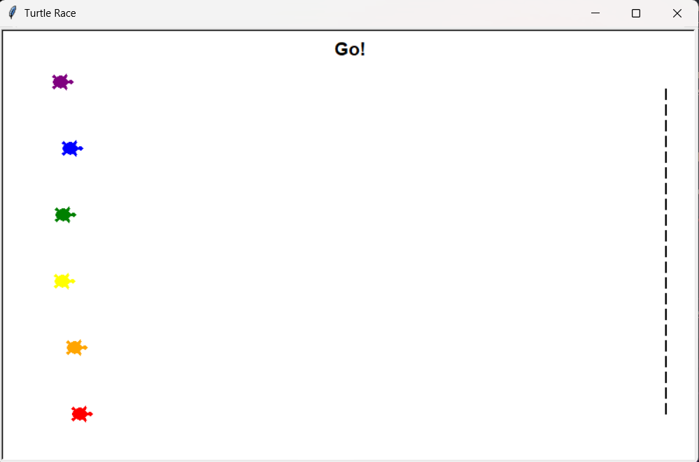

# 🐢 Turtle Race

A tiny Python mini-game built with the standard **turtle graphics** module.  
Pick a color, place your bet, and cheer like it matters.

---

## ✨ Features
- Clean track with dashed finish line
- Six classic colors: `red`, `orange`, `yellow`, `green`, `blue`, `purple`
- One simple race per run (no menus, no drama)
- Slower pace so you can actually see the turtles move

---

## 📸 Preview


---

## 🧰 Requirements
- **Python 3.10+**
- Uses only the Python **standard library**:
  - `turtle`
  - `random`
  - `time`

> If Python isn’t installed, get it from [python.org/downloads](https://www.python.org/downloads/).

---

## 🚀 Run
Clone and run:

```bash
git clone https://github.com/<your-username>/turtle-race.git
cd turtle-race
python3 turtle_race.py
